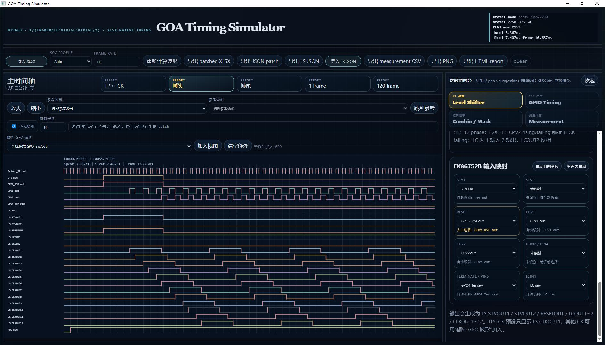

# GOA Timing Simulator

本项目是 GOA timing 波形调试器，用于按 XLSX 原生寄存器结构调试 MT9216 / MT9603 / MT9633 的 GPIO timing、Level Shifter 输出和 timing measurement。



## 当前范围

- 直接导入 `.xlsx`，老 `.xls` 先由用户自行转换成 `.xlsx`。
- 第一阶段重点解析 GPIO timing 相关内容。
- Level Shifter 已支持单 EK86707A、双 EK86707A、单 iML7272B/iML7272BK、单 EK86752B 预览。
- MT9603 / MT9633 的 Driver_TP 按 data_cmd 特例生成，不强行从 GPO 映射。
- Timing engine 只使用 XLSX 里的实际寄存器值，不拿 PDF/panel spec 的 `V-total` 参与计算。

## 运行

```bash
npm ci
npm run dev
```

构建：

```bash
npm run build
```

## 文档

- [GOA Timing XLSX 参数指南](docs/goa-timing-xlsx-parameter-guide.md)：说明 Panel/GPIO/Entry/Mask/Combin/Level Shifter/patch 的当前仿真语义和调参风险点。

## 时间基准

MT9216 使用绝对 PCNT 时间：

```text
1pcnt = 1 / (Htotal * Vtotal * frameRate)
1lcnt = Htotal * 1pcnt
1frame = 1 / frameRate
```

注意：`PanelHTotal` 寄存器值按当前经验使用 `PanelHTotal + 1` 作为实际 `Htotal`。

## 核心模型

- Entry 是电平切换点，不是 edge trigger。
- `Repeat_mode_SEL=0` 是 by line，行尾电平 carry 到下一行行首。
- `Repeat_mode_SEL=1` 是 by frame，entry 按 `LCNT * Htotal + PCNT` 一维绝对位置触发。
- Mask 按 V/H 区域过滤，区域外输出 `Region_other_Value`。
- Combin 按真实 `Combin_Type_SEL` 计算，不把辅助源强行理解为 XOR。

## 调参方式

- UI 保留 XLSX 原生结构：sheet / GPO / entry / 原始列名 / cell address。
- 支持多个详细调参页：Level Shifter、GPIO Timing、Combin/Mask、Signal Mapping、Measurement/Calculator。
- GPIO 参数通过统一校验后生成 patch，并即时重新计算 raw/source/merge/CK 方波。
- 手动输入、拖拽和测量修正共用整数、范围、by-line / FCNT 帧边界校验；无效修改不写入。

## 信号规则

- STV、CPV1、CPV2、Driver_TP、Init_TP 默认自动识别。
- 自动识别优先看 XLSX 寄存器结构和明确端口标注。
- `raw` 是主 GPO。
- `source` 是辅助合并源 GPO。
- `merge` 是按 `Combin_Type_SEL` 融合后的最终输出。

## TER/CPV2 判定

单 EK86707A 当前规则：

- `CPV2 Repeat_mode_SEL=0 && OCP_SEL=1`：该脚作为 CPV2。
- `CPV2 Repeat_mode_SEL=1 && OCP_SEL!=1`：该脚作为 TER。
- `CPV2 Repeat_mode_SEL=1 && OCP_SEL=1`：强提醒，frame 刷新与二进八出模式逻辑不匹配。
- `CPV2 Repeat_mode_SEL=0 && OCP_SEL!=1`：不静默猜，提示用户确认或检查模式。

RST 没有可靠寄存器判定规则，MVP 必须由用户从 XLSX 原生 GPO 表或波形列表手动选择。

## Measurement

不做厂商 timing spec 模板。

- 用户自行选择任意两个边沿。
- T1/T2/T3 只是用户自定义标签。
- 工具负责计算、显示、保存和导出 JSON/CSV。

## 验证规则

- `Repeat_mode_SEL=0` by-line 时禁止修改 LCNT。
- `0 <= PCNT < Htotal`。
- Driver_TP / Init_TP entry 节点数量默认不允许改。
- 修改后通过 patch diff 和 patched XLSX 导出。
- patched XLSX 采用 cell 级 zip/xml 替换，不重新生成整份 workbook。

## 开发与验证

- Node.js：`^20.19.0 || >=22.12.0`；`.nvmrc` 使用 Node 22。
- npm 10+；提交了完整锁文件，使用 `npm ci` 安装。`packageManager` 记录 npm 10.8.2。
- `npm run typecheck`：检查应用与测试类型，同时阻止新增未使用的应用符号。
- `npm test`：执行 `src` 下全部 `*.test.ts`，涵盖仿真、编辑、测量、Worker 客户端和 XLSX 导出回读。
- `npm run check`：统一运行类型检查、测试和生产构建。GitHub Actions 在 Linux Node 20/22/24 上运行相同检查。
- XLSX 使用 SheetJS 官方文档提供的 0.20.3 发布包，依赖及完整性摘要锁定在 `package-lock.json`；安装需要访问 `cdn.sheetjs.com`。
- Windows 首次构建前运行 `npx neu update` 下载配置中固定版本的桌面运行时，再运行 `npm run dist:win`。
- [Windows 验证清单](docs/windows-validation.md)：本次修复的实机验收项。

## 编辑与测量约定

- 测量 ID 在同一项目内单调递增，删除后不复用。
- `pcnt` / `lcnt` Target 随时间基准重新换算；`us` / `ms` 等时间单位保持物理时间不变。
- 起点修正与终点修正方向相反；未绑定测量端点的 entry 明确按手动偏移处理，同时控制两个端点的 entry 不提供间隔修正。
- 真实边沿消失时测量标记失效；手动选点继续保持绝对位置。
- 拖拽保持原 FCNT，不能通过 LCNT 隐式跨越 FCNT 指定的帧；跨帧调整需显式修改 FCNT。
- 导入文件必须包含 `Panel` / `GPIO`、有效的 `PanelHTotal` / `PanelVTotal` 和可识别的 GPO entry，不再使用静默默认时序。
- XLSX 导出保留被修改单元格的样式和其他属性；写入字面值时移除该单元格原公式，其他 ZIP 项保持原数据。
